# 🌍 Eastern Ghats Mobile Belt Field Study

## Geological Field Report  
**Regions of Bhabandha, Bhatakumuruda, Baghdevi and Athagadapatana**  
Ganjam District, Odisha, India

---

# 📘 Project Overview

This repository presents a **Geological Field Study of the Eastern Ghats Mobile Belt (EGMB)** conducted as part of undergraduate geology field training.

The study focuses on:

- Lithology
- Structural Geology
- Geomorphology
- Stratigraphy
- Economic geology

The **Eastern Ghats Mobile Belt** represents one of the most important **Proterozoic high-grade metamorphic terrains of India**.

---

# 🧑‍🎓 Academic Details

**Submitted by**

Bikrant Kumar Mishra  
Regd No: 11132/2023  
Exam Roll No: UG2302GEO009  

Course: Undergraduate (Geology)

**Department**

P.G Department of Geology  
Khallikote Unitary University  
Berhampur, Odisha

---

# 👨‍🏫 Under the Guidance of

Dr. Deepak Kumar Mishra  
Associate Professor (HoD, Geology)

Dr. Rajat Kumar Panda  
Assistant Professor (Geology)

Dr. Manisha Das  
Assistant Professor (Geology)

---

# 📑 Contents of the Report

1. Introduction  
2. Geomorphology  
3. Lithology  
4. Structural Geology  
5. Stratigraphy  
6. Economic Importance  
7. Conclusion

---

# 📍 Study Area

The study area lies within the **Eastern Ghats Mobile Belt** in **Ganjam district of Odisha**.

The region consists mainly of:

- Garnetiferous Gneiss
- Biotite Gneiss
- Granite
- Quartz veins
- Mafic Dyke intrusions
- Folded metamorphic rocks

These rocks show **intense deformation, metamorphism and structural complexity**.

---

# 🗺 Toposheet

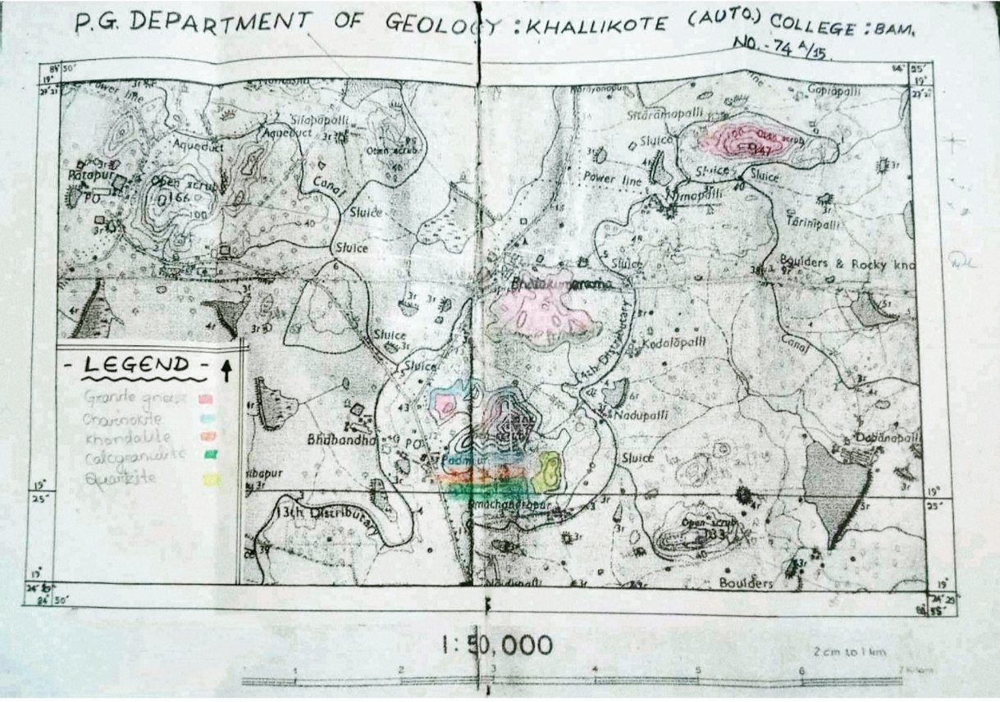

Toposheet No: **74A/15**  
(Source: Survey of India)

Used for field navigation and geological mapping.

---

# 🪨 Lithological Observations

## Bhabandha Geological Outcrop

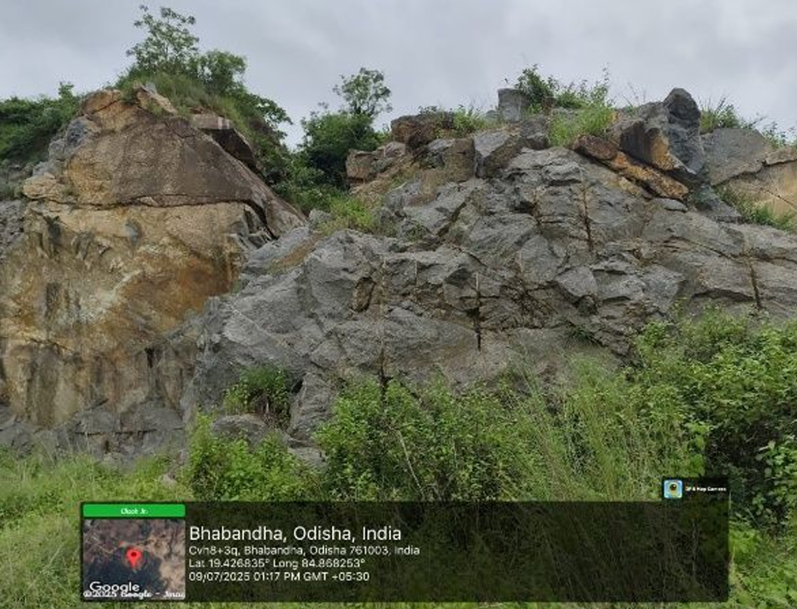

---

## Biotite Gneiss

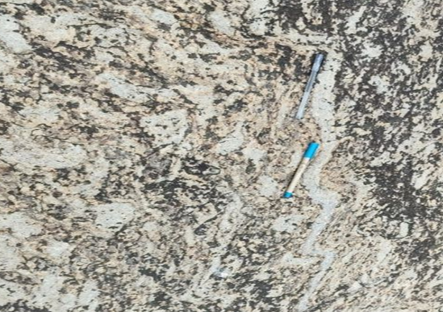

Biotite gneiss is a **medium to coarse grained metamorphic rock** showing clear gneissic banding.

---

## Garnetiferous Gneiss

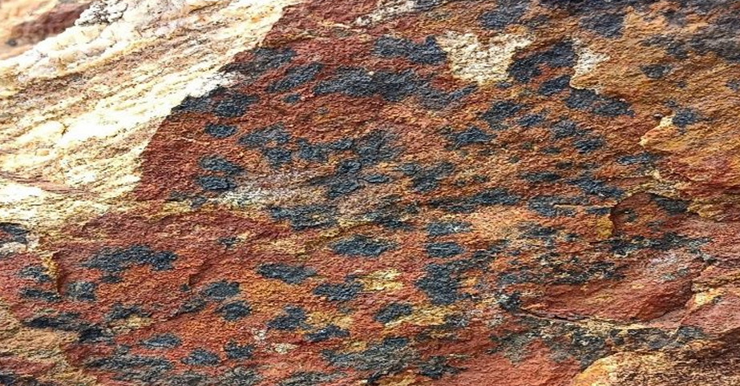

Metamorphic rock containing **garnet porphyroblasts** within a gneissic matrix.

---

## Garnet Texture

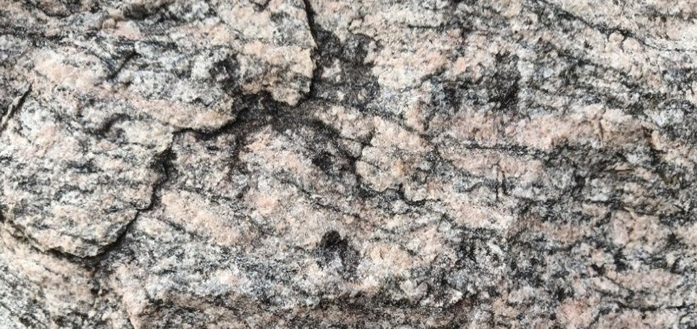

Shows crystal development of garnet minerals during metamorphism.

---

## Garnet Pokering (Weathering)

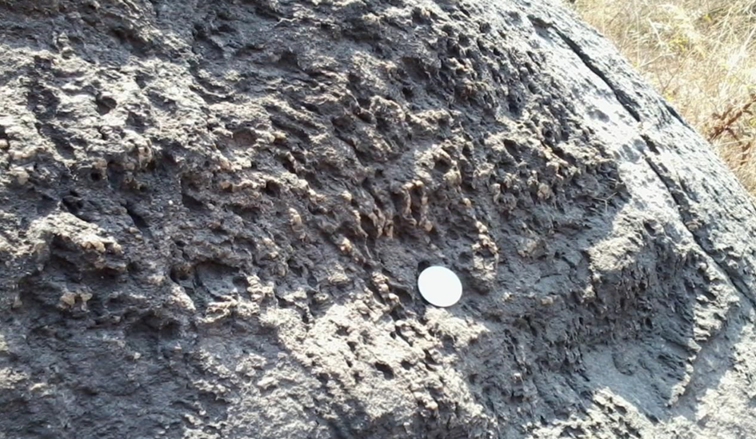

Garnet crystals protrude due to **differential weathering**.

---

## Gneissic Banding

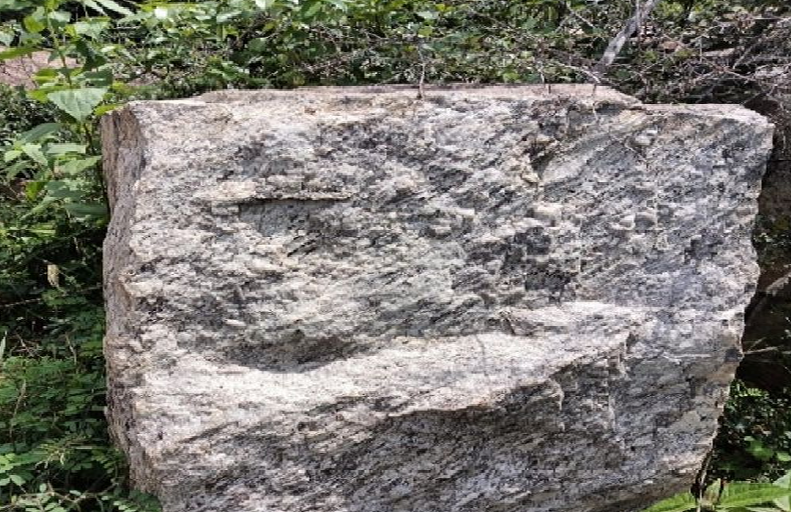

---

## Gneissic Banding (EGMB)

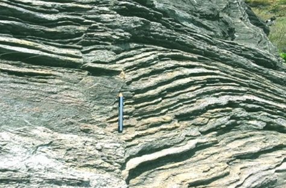

Gneissic banding forms due to **segregation of light and dark minerals during metamorphism**.

---

## Granite Outcrop

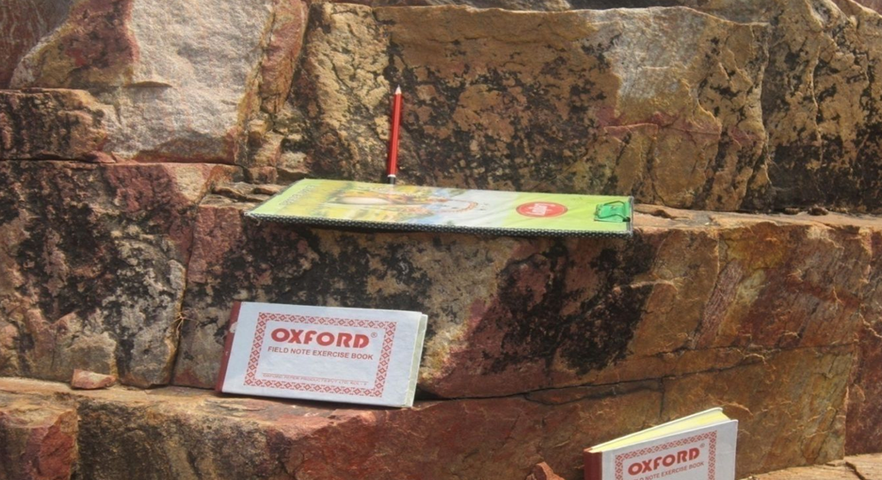

Granite represents **intrusive igneous activity within the metamorphic terrain**.

---

# 🔬 Structural Geology

Several important geological structures were observed in the field.

---

## Anticline Fold

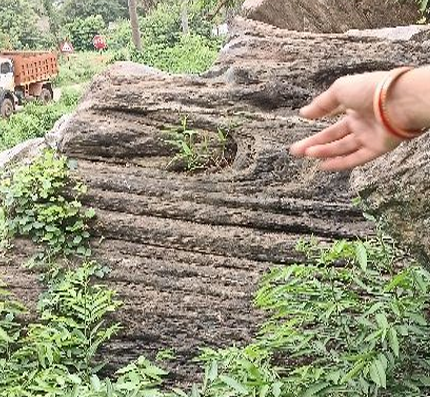

Upward arching fold structure produced by **compressional tectonic forces**.

---

## Syncline Fold

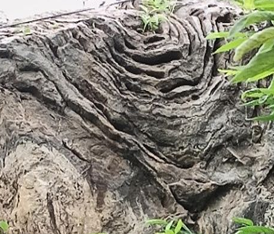

Downward fold structure where younger rocks occupy the center.

---

## Chevron Fold

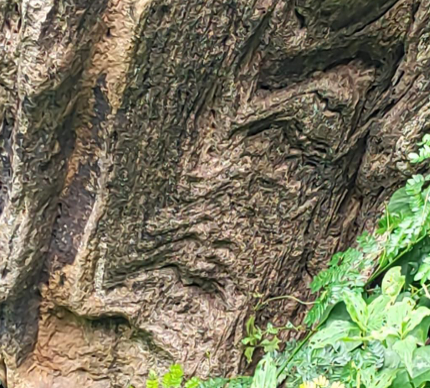

Angular fold structure commonly formed under strong compression.

---

## Isoclinal Fold

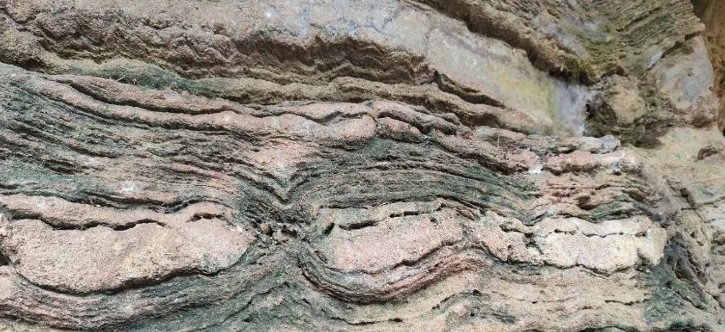

Fold limbs are nearly parallel due to **intense deformation**.

---

## Fault Displacement

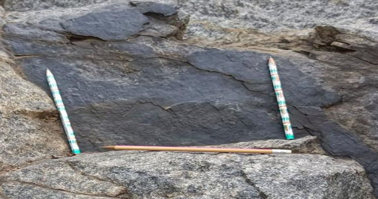

Faults represent fractures where **movement has occurred**.

---

## Dyke Intrusion

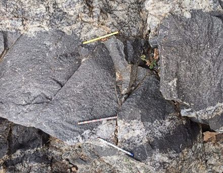

Igneous intrusion cutting across host metamorphic rocks.

---

## Mafic Dyke Intrusion

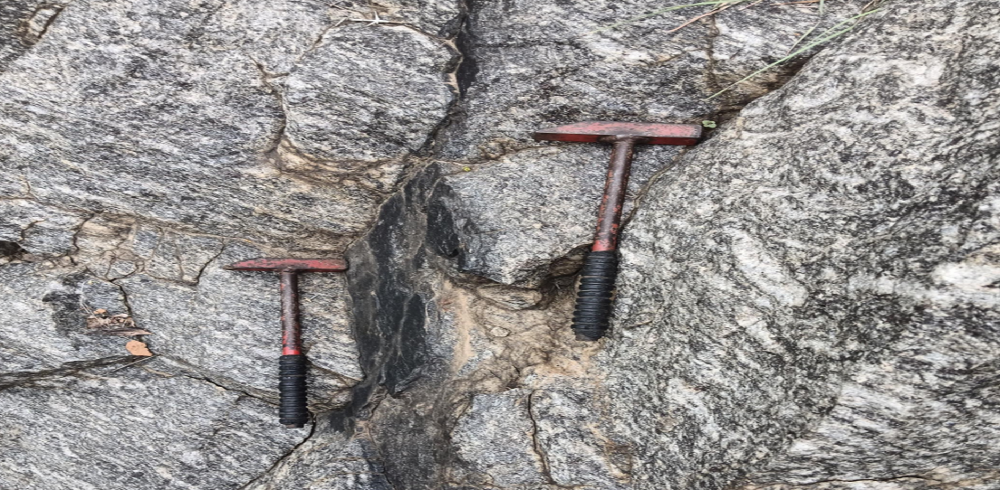

Evidence of **later magmatic activity**.

---

## Quartz Feldspar Vein

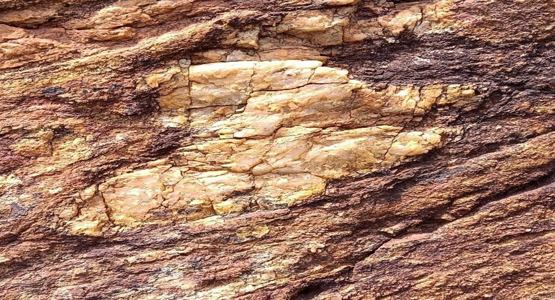

Represents hydrothermal mineralization.

---

## Mica Schist Foliation

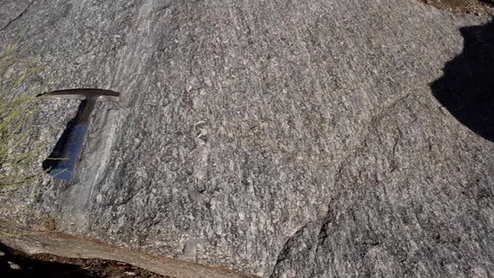

Planar structure formed due to **mineral alignment during metamorphism**.

---

## Augen Gneiss

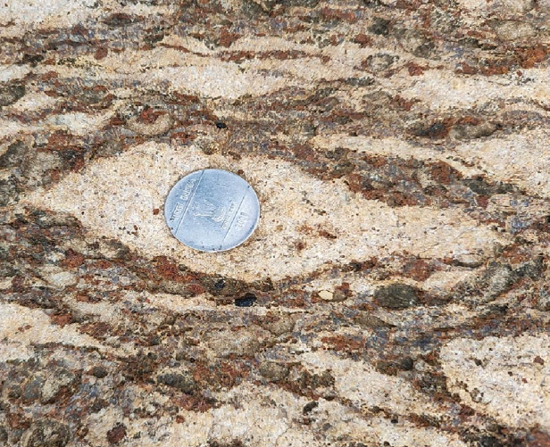

Contains eye-shaped **orthoclase porphyroblasts** wrapped in quartz matrix.

---

## Tor Landform

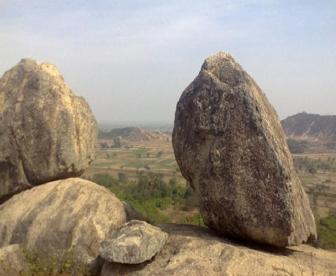

Weathering of granite results in **tor landforms**.

---

# 💰 Economic Importance

The Eastern Ghats region contains important minerals such as:

- Graphite
- Quartz
- Feldspar
- Garnet

These minerals are widely used in:

- Abrasives
- Industrial materials
- Refractory industries
- Construction materials

---

# 🧾 Conclusion

The field investigation demonstrates the **complex geological evolution of the Eastern Ghats Mobile Belt**.

Major observations include:

- High grade metamorphism
- Fold structures
- Faulting
- Dyke intrusions
- Gneissic banding
- Garnetiferous rocks

These structures provide valuable insight into the **tectonic history of the Indian shield**.

---

# 📄 Full Geological Field Report

Complete report available here:

🔗  
https://drive.google.com/file/d/1RARTVAqPCuQO_Yaq7eBROUf2qzYmINB_/view?usp=sharing

---

# 📌 Author

**Bikrant Kumar Mishra**  
Geology Student  
Khallikote Unitary University  
Odisha, India
